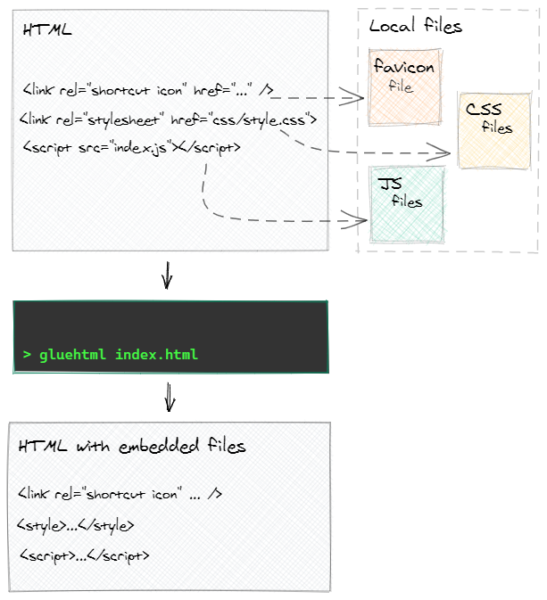

[](https://badge.fury.io/js/gluehtml)

#### Overview

gluehtml packs HTML file includes into a single self-contained HTML file with no references to the local .js or .css files. The output can be used in some restricted systems or quickly copied to a different locations.



#### Install

```bash
yarn global add gluehtml
```

#### Refs

* [Vite build.polyfillModulePreload](https://vitejs.dev/config/build-options.html#build-polyfillmodulepreload)
    * [ES Module Preloading & Integrity](https://guybedford.com/es-module-preloading-integrity#modulepreload-polyfill)
        * [Preloading modules](https://developer.chrome.com/blog/modulepreload)


<!-- 
    "scripts": {
        "dev": "parcel build src/index.ts --target node --no-optimize",
        "build-ts": "parcel build src/cli.ts --no-source-maps --no-optimize",
        "build": "rm -rf dist && yarn build-ts && cp src/cli.js dist",
        "prepublish": "yarn build"
    },
-->
 
<!-- 
    "main": "dist/cli.js",
-->

<!-- 
    "targets": {
        "main": {
            "includeNodeModules": true,
            "source": "src/main.ts",
            "distDir": "./dist"
        }
    },

    "outputFormat": "commonjs"

const main = require(src);
console.log('\ntm', main);
-->

<!--
function isLocalUrl(item: Item) {
    // const rel = item?.rel?.trim().toLowerCase() || '';
    // let isLocal: boolean | number = !item.rel || ~rel.indexOf('stylesheet'); // skip 'rel=icon' but handle =stylesheet and ="stylesheet"
    // isLocal && (isLocal = !item.url.match(/^https?|^data:/));
    // return isLocal;

    // <link rel="icon" type="image/svg+xml" href="./assets/favicon.5917fe4c.svg" />

    // <script type="module" crossorigin src="./assets/index.f4f1edf6.js"></script>
    // <link rel="modulepreload" crossorigin href="./assets/radix-ui.c22f7705.js">
    //      Uncaught SyntaxError: Cannot use import statement outside a module

    // gluehtml utility for gluing js and css into html files. version 0.2.9
    // HTML file: C:\Y\w\2-web\8-websites-ideas\4-react\dropzone\dist\index.html
    //   document links 5 (5 of them are local links):
    //       url: ./assets/favicon.5917fe4c.svg
    //       url: ./assets/vendor.cdd975c5.js
    //       url: ./assets/radix-ui.c22f7705.js
    //       url: ./assets/index.4e8ccc0c.css
    //       url: ./assets/index.f4f1edf6.js
    //   merging local files:
    //       C:\Y\w\2-web\8-websites-ideas\4-react\dropzone\dist\assets\favicon.5917fe4c.svg
    //       C:\Y\w\2-web\8-websites-ideas\4-react\dropzone\dist\assets\vendor.cdd975c5.js
    //       C:\Y\w\2-web\8-websites-ideas\4-react\dropzone\dist\assets\radix-ui.c22f7705.js
    //       C:\Y\w\2-web\8-websites-ideas\4-react\dropzone\dist\assets\index.4e8ccc0c.css
    //       C:\Y\w\2-web\8-websites-ideas\4-react\dropzone\dist\assets\index.f4f1edf6.js
    // tag style link {"rel":"icon","type":"image/svg+xml","href":"./assets/favicon.5917fe4c.svg"}
    // tag style link {"rel":"modulepreload","crossorigin":"","href":"./assets/vendor.cdd975c5.js"}
    // tag style link {"rel":"modulepreload","crossorigin":"","href":"./assets/radix-ui.c22f7705.js"}
    // tag style link {"rel":"stylesheet","href":"./assets/index.4e8ccc0c.css"}
    // tag script script {"type":"module","crossorigin":"","src":"./assets/index.f4f1edf6.js"}
    //   new file saved to: C:\Y\w\2-web\8-websites-ideas\4-react\dropzone\dist\index--single.html
    
    return !item.url?.match(/^https?|^data:/);
}
-->
